# Trabajo de Investigación
### Gestor de Base de Datos MySQL Community Edition
#### Elaborado por Grupo 4 INF-272

## Introducción
Este documento proporciona una guía para la adquisición e instalación de MySQL Community Edition, la versión de código abierto del gestor de base de datos MySQL. Esta edición es particularmente apropiada para desarrolladores, así como pequeñas y medianas empresas, y se destaca en entornos académicos por ser una solución robusta y sin costo.

## Nota sobre las versiones de MySQL
- **MySQL Community Edition**: Esta versión de código abierto y gratuita de MySQL es óptima para el ámbito educativo, donde el desarrollo de aplicaciones, la administración de bases de datos y la investigación en tecnología son frecuentes. Su accesibilidad y funcionalidad la convierten en la elección principal para fines educativos.
- **MySQL Enterprise Edition**: Orientada a negocios que demandan un mayor nivel de seguridad, rendimiento y disponibilidad, la Enterprise Edition es una versión comercial con funciones adicionales y soporte técnico de Oracle. 

Dado que el objetivo de este trabajo es de naturaleza académica, nos centraremos en la instalación y uso de MySQL Community Edition.

## 1. Obtención del Instalador de MySQL Community Edition

### 1.1. Acceso a la Página de Descargas
Para comenzar la instalación de MySQL Community Edition, visite la [página oficial de descargas de MySQL](https://dev.mysql.com/downloads/mysql/). Allí encontrará dos categorías principales:

- **Lanzamientos de Disponibilidad General (GA)**: Estas son las versiones más actuales, ideales para entornos de producción y con las últimas actualizaciones de funcionalidades y seguridad.
  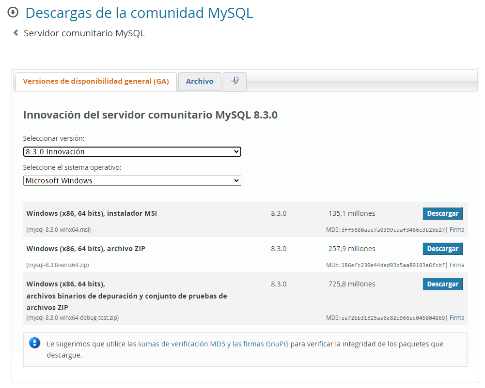
- **Archivos Históricos (Archives)**: Estos incluyen versiones anteriores de MySQL, útiles cuando se necesita compatibilidad con sistemas que requieren versiones específicas que ya no están en la categoría GA.
  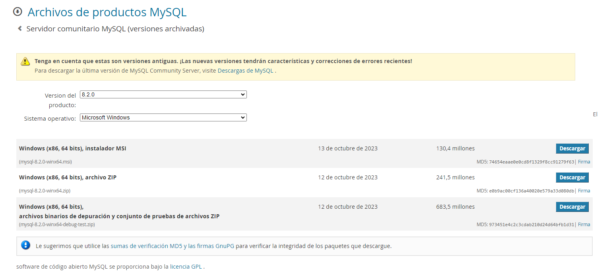

Se recomienda optar por las versiones GA para asegurarse del soporte completo y las actualizaciones más recientes. Las versiones archivadas deben usarse solo en circunstancias específicas que requieran una versión anterior.

### 1.2. Selección de la Versión y Sistema Operativo
Dentro de la sección GA, seleccione la última versión estable para garantizar la incorporación de las más recientes mejoras y parches de seguridad.  
A la fecha de esta documentación, se dispone de las siguientes versiones:
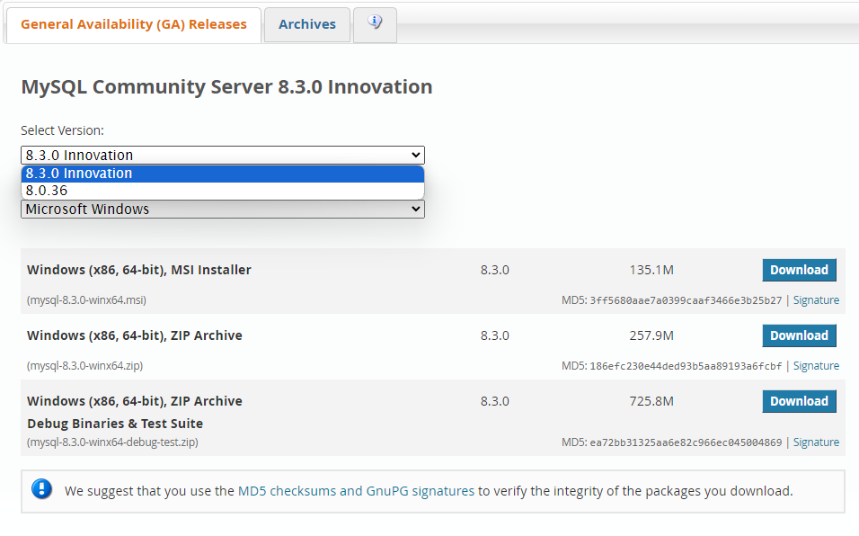
- **8.3.0 Innovación**: Incluye las últimas innovaciones de MySQL, recomendada para los usuarios que desean experimentar con las funciones más recientes.
- **8.0.36**: La versión más estable dentro de la serie 8.0.x. Es recomendable para aquellos usuarios que buscan una versión con una base probada de estabilidad y madurez.

Para este trabajo, elegimos la versión `8.0.36` y el sistema operativo Windows, debido a su estabilidad y por ser la opción más adecuada para un entorno de aprendizaje.

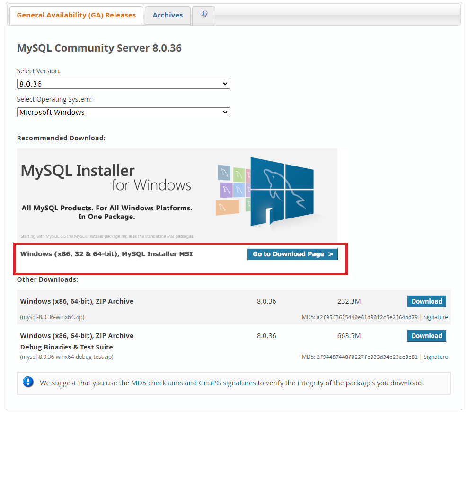

La página presenta las siguientes opciones de descarga:

1. **MySQL Installer for Windows**: Esta es la descarga recomendada y contiene el MySQL Installer, un asistente de instalación que facilita la configuración de MySQL y de otros productos relacionados. El instalador es adecuado para todas las plataformas de Windows y proporciona un paquete único que incluye todas las herramientas y componentes necesarios.

2. **Otras descargas**:
   - **Archivo ZIP**: Contiene los archivos binarios de MySQL para Windows en un archivo comprimido. Esta opción requiere una configuración manual y es útil si se necesita una instalación personalizada o si se va a desplegar en múltiples máquinas sin la ayuda del asistente de instalación.
   - **Archivos binarios de depuración y conjunto de pruebas**: Incluye binarios para depuración y pruebas de MySQL. Es una opción orientada principalmente para desarrolladores que necesitan depurar aplicaciones o contribuir al desarrollo de MySQL.

### 1.3. Opciones de Descarga de MySQL Installer para Windows
Al seleccionar MySQL 8.0.36 para Windows, encontrará dos opciones de instalador MSI:
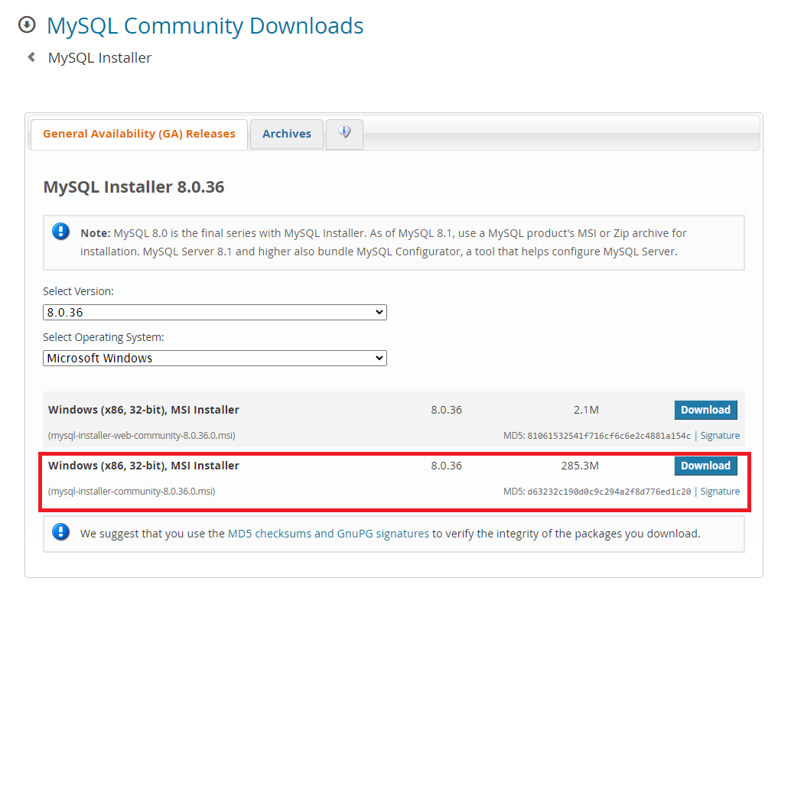

1. **Instalador MSI para Windows (x86, 32-bit) - Versión Web**: Un instalador compacto que requiere conexión a internet para descargar los componentes durante la instalación.
2. **Instalador MSI para Windows (x86, 32-bit) - Versión Completa**: Este archivo más grande incluye todos los componentes y es ideal para situaciones donde no se dispone de conexión a internet continua.

Para garantizar que todos los componentes estén disponibles sin depender de la conectividad, recomendamos descargar la **Versión Completa** del instalador MSI.

### 1.4. Proceso de Descarga

1. Haga clic en el botón `Descargar` correspondiente a la versión completa del instalador MSI. Esto lo llevará a una página que le ofrece la opción de iniciar sesión o registrarse para una cuenta de Oracle. Si no desea crear una cuenta, simplemente puede iniciar la descarga del instalador seleccionando la opción `No thanks, just start my download.`, ubicada al final de la página.

   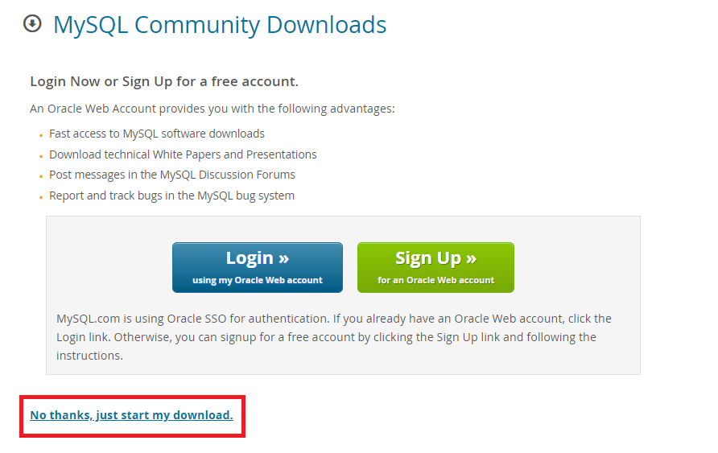

2. Antes de ejecutar el instalador, recomendamos verificar la suma de comprobación MD5 y la firma digital GnuPG para confirmar la integridad y autenticidad del paquete.

---

## 2. Instalación de MySQL Community Edition

### 2.1. Iniciando el Instalador
Localice y ejecute el archivo `.msi` descargado para lanzar MySQL Installer, que es el programa de instalación y gestión para productos MySQL.
   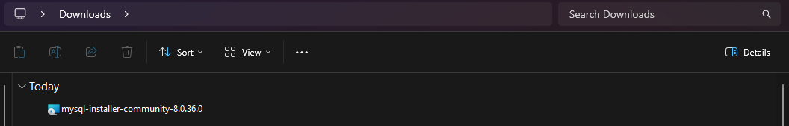

### 2.2. Uso del MySQL Installer
Cuando MySQL Installer se inicie, se presentará con una interfaz que enumera los productos de MySQL que están listos para la instalación o que ya están instalados. En su caso, debería ver `MySQL Shell` como un producto ya listo.

La interfaz del instalador ofrece varias opciones para gestionar sus productos MySQL:
   - **Add (Agregar)**: Si desea instalar componentes adicionales de MySQL, como el servidor de bases de datos o herramientas adicionales, haga clic en esta opción. Le llevará a una pantalla donde puede seleccionar de una lista de productos MySQL disponibles para su instalación.
   - **Modify (Modificar)**: Esta opción le permite cambiar los componentes que ya ha instalado. Puede agregar o quitar funcionalidades individuales de los productos existentes.
   - **Upgrade (Actualizar)**: Utilice esta función para buscar actualizaciones de los productos de MySQL ya instalados y llevarlos a la versión más reciente.
   - **Remove (Eliminar)**: Si necesita desinstalar cualquier componente de MySQL, esta opción le permitirá hacerlo.

### 2.3. Selección de Componentes

En la pantalla 'Select Products' del MySQL Installer, deberá seleccionar los componentes que serán instalados. 
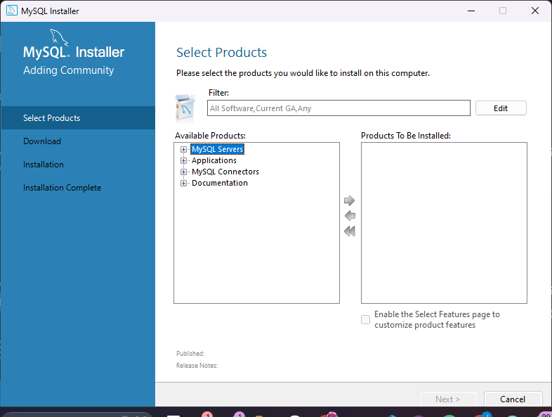
#### MySQL Servers
- **MySQL Server 8.0**: Este es el servidor de bases de datos principal y el componente esencial que debe instalarse. Actúa como el motor que maneja y almacena todas sus bases de datos.

#### Applications
- **MySQL Workbench**: Es una herramienta integral para el diseño, modelado, generación y administración de bases de datos MySQL. Es fundamental para quienes prefieren una interfaz visual para gestionar sus bases de datos.
- **MySQL Shell**: Es un intérprete de comandos avanzado que soporta scripting en SQL, Python y JavaScript. Es una poderosa herramienta para interactuar con el servidor MySQL mediante línea de comandos y es útil para tareas administrativas avanzadas y scripting.

#### MySQL Router
- **MySQL Router**: Este componente es fundamental para crear una capa de enrutamiento entre su aplicación y el clúster de MySQL. MySQL Router dirige automáticamente el tráfico de la base de datos entre la aplicación y cualquier servidor MySQL, incluyendo replicación de grupo y clústeres InnoDB. Es especialmente útil en entornos que utilizan alta disponibilidad y balanceo de carga.

#### MySQL Connectors
Estos conectores son cruciales para desarrollar aplicaciones en diversos lenguajes de programación que se comunicarán con MySQL:
- **Connector/ODBC**: Seleccione este conector si está planeando conectar aplicaciones que utilicen el estándar ODBC para comunicarse con bases de datos MySQL.
- **Connector/C++**: Necesario si desarrollará aplicaciones en C++ que requieran interactuar con MySQL.
- **Connector/J**: Es el conector JDBC para aplicaciones Java. Si su desarrollo involucra Java y necesita conectividad con MySQL, este conector es indispensable.
- **Connector/NET**: Para aplicaciones que se ejecutan en el framework .NET, este conector es el apropiado.
- **Connector/Python**: Si sus proyectos involucran programación en Python y necesitan acceso a bases de datos MySQL, este es el conector que deberá instalar.

Para seleccionar estos componentes, siga los siguientes pasos:

1. En la lista 'Available Products' (Productos Disponibles), haga clic en los signos de más (+) para expandir las categorías.
2. Marque las casillas de los componentes que desea instalar. A medida que los selecciona, estos aparecerán en el panel 'Products To Be Installed' (Productos para Instalar) en el lado derecho.
3. Asegúrese de verificar cada categoría para no pasar por alto componentes importantes para su uso específico.
4. Si se requiere una configuración más específica para cada producto, active la opción 'Enable the Select Features page to customize product features' en la parte inferior de la ventana para personalizar las características de los productos seleccionados.

Para nuestro propósito, elegimos 'MySQL Server 8.0.36 - X64' y 'MySQL Workbench 8.0.36 - X64', que son las últimas versiones disponibles en arquitectura de 64 bits, compatibles con nuestro equipo. La elección de estas versiones asegura que estamos utilizando las iteraciones más estables y seguras de estas herramientas fundamentales.
Tras seleccionar los productos y haga clic en 'Next'.

### 2.4. Descarga de Componentes
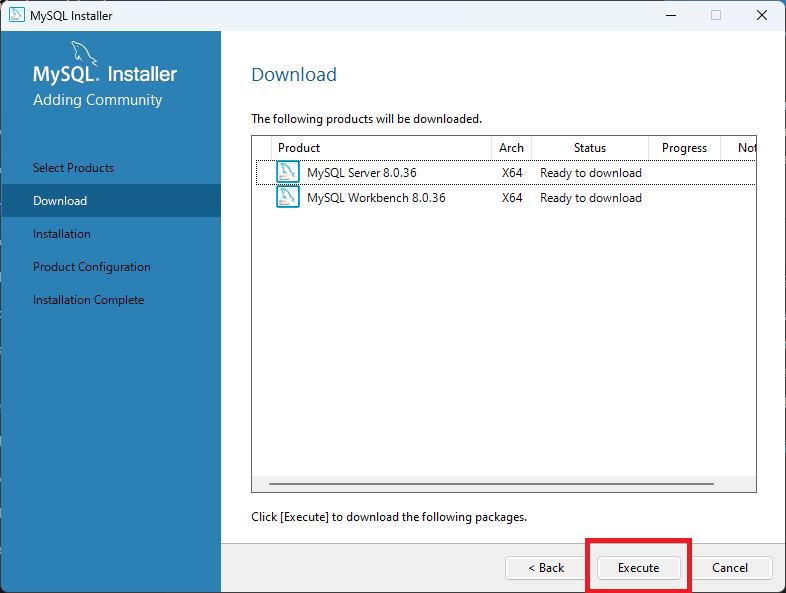

La ventana 'Download' (Descarga) muestra los productos que han sido seleccionados para la instalación y están listos para ser descargados:

1. **Revise la lista** para confirmar que todos los componentes que desea instalar están presentes. Debería ver tanto 'MySQL Server 8.0.36' como 'MySQL Workbench 8.0.36', listos para la descarga.

2. **Haga clic en 'Execute'** (Ejecutar) para comenzar a descargar los paquetes seleccionados. El instalador se conectará a los servidores de MySQL para obtener los archivos necesarios.

3. **Espere a que se complete la descarga**. El progreso se mostrará en la barra de estado junto a cada componente. Si alguna descarga falla, el instalador le ofrecerá la opción de reintentar.
   
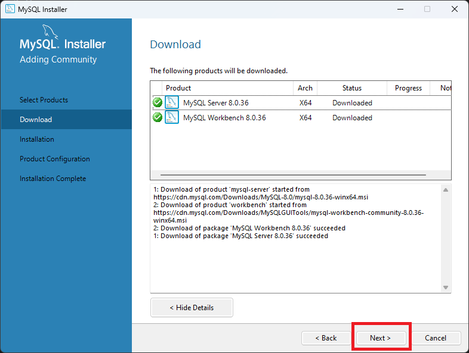
Una vez que todos los componentes han sido descargados satisfactoriamente haga clic en **'Next'** para proceder a la fase de instalación, donde el instalador instalará los productos descargados en su sistema.

### 2.5. Configuración del Producto MySQL

Una vez completada la descarga de los componentes seleccionados, el MySQL Installer le llevará a la etapa de 'Product Configuration' (Configuración del Producto). En esta pantalla, verá el 'MySQL Server 8.0.36' listado y listo para ser configurado.

Para comenzar la configuración:

1. Asegúrese de que 'MySQL Server 8.0.36' esté resaltado en la lista.
2. La ventana le informa que puede proceder con el asistente de configuración del producto seleccionado. Además, se le da la opción de cancelar si prefiere no configurar todos los productos en este momento.
3. Haga clic en 'Next' para iniciar el asistente de configuración y definir las configuraciones de su servidor MySQL. Esto incluirá la configuración de tipos de redes, cuentas de usuarios, seguridad del servidor y más.
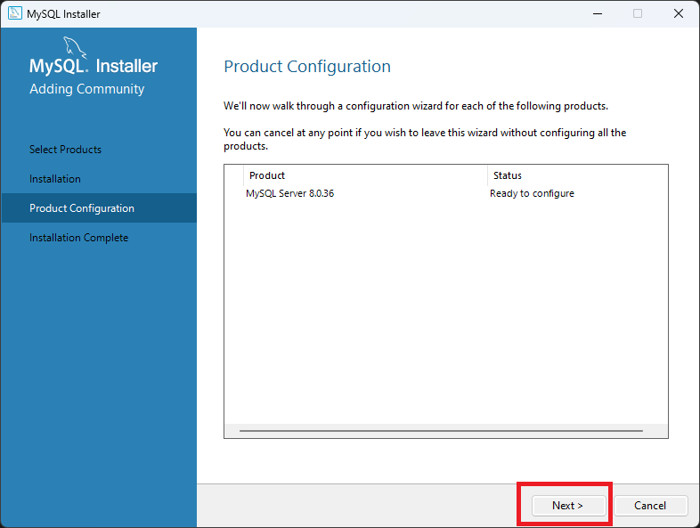

### 2.6. Configuración de Tipo de Servidor y Red en MySQL Server
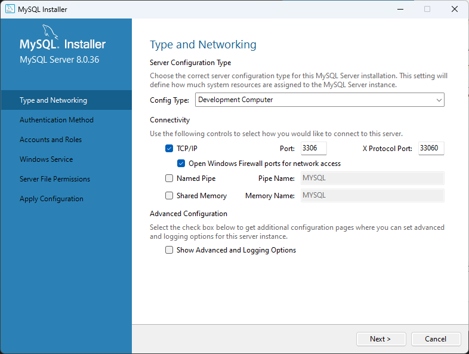
En la etapa de 'Type and Networking' del MySQL Server 8.0.36, se realizaran ajustes esenciales que definirán el comportamiento del servidor y su interacción con la red:

1. **Tipo de Configuración del Servidor**:
   - Seleccione 'Development Computer' del menú desplegable 'Config Type'. Este ajuste optimiza el servidor para un entorno de desarrollo, limitando la utilización de recursos del sistema y ajustando el rendimiento para escenarios no críticos.

2. **Conectividad**:
   - Confirme que 'TCP/IP' está habilitado y el 'Port' se mantiene en el valor predeterminado de `3306`, el puerto estándar para conexiones de base de datos MySQL. Esto garantiza la interoperabilidad con la mayoría de las aplicaciones cliente MySQL.
   Para el 'X Protocol Port', el puerto predeterminado 33060 se utiliza para conexiones con el X Protocol.
   - Active la opción 'Open Windows Firewall ports for network access' para crear una regla de firewall que permita el tráfico hacia y desde el servidor en el puerto especificado, esencial para la comunicación remota con el servidor.

3. **Configuración Avanzada**:
   - Por defecto, no seleccione 'Show Advanced and Logging Options' si su intención es mantener una configuración básica. Las opciones avanzadas y de registro proporcionan una granularidad mayor para el afinamiento del servidor y son más adecuadas para entornos de producción o cuando se requiere un monitoreo detallado del rendimiento y los eventos del servidor.

Tras configurar estos parámetros proceda con **'Next'** para avanzar al siguiente paso.

### 2.7. Elección del Método de Autenticación en MySQL Server

- Opte por **"Use Strong Password Encryption for Authentication"**. Esta opción moderna fortalece la seguridad usando encriptación SHA256 y es compatible con los conectores MySQL 8.0 actualizados.

Presione **"Next"** para continuar al siguiente paso de configuración.

### 2.8. Establecimiento de Cuentas y Roles en MySQL

A continuación se presetará la configuración "Accounts and Roles":
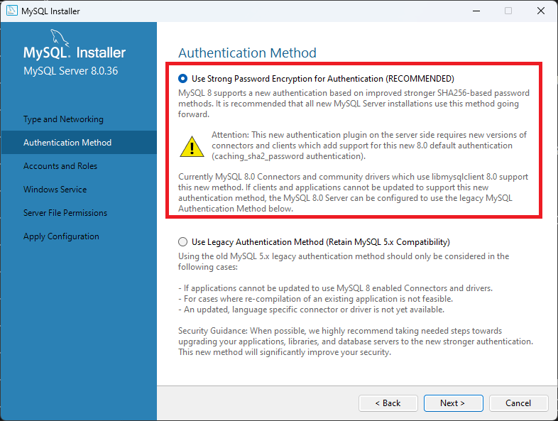

- Configure la **contraseña de la cuenta root**. Es crucial elegir una contraseña fuerte y única para la cuenta de administrador del servidor MySQL (root). 
  
- Repita la contraseña en el campo "Repeat Password" para confirmarla.

Una vez establecida la contraseña de root:

- Si así lo desea use el botón **"Add User"** para crear cuentas adicionales de usuario para su aplicación o usuarios individuales.

Al completar esta configuración, haga clic en **"Next"** para avanzar al siguiente paso del proceso de instalación.

### 2.9. Configuración del Servicio de Windows para MySQL

En "Windows Service" configurará MySQL para que se ejecute como un servicio de Windows:
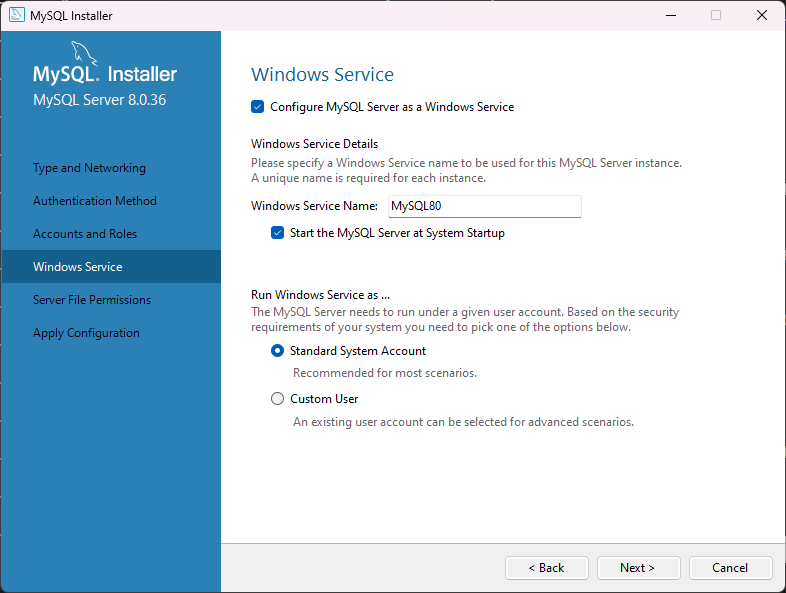

- **Nombre del Servicio de Windows**: Deje el nombre predeterminado `MySQL80` o elija un nombre personalizado para el servicio que sea único en su sistema.

- **Inicio Automático**: Marque la opción "Start the MySQL Server at System Startup" para que el servicio de MySQL se inicie automáticamente con Windows. Esto es recomendable para asegurarse de que el servidor de bases de datos esté siempre disponible cuando inicie su máquina.

- **Cuenta del Sistema para Ejecutar el Servicio**: Seleccione "Standard System Account" para que el servicio de MySQL opere bajo la cuenta del sistema estándar. Esta es la opción preferida para la mayoría de los escenarios, ya que ofrece un buen equilibrio entre seguridad y facilidad de uso sin la necesidad de gestionar permisos de usuario específicos.

Después de configurar estas opciones. Haga clic en **"Next"** para proceder a la siguiente fase, que abordará los permisos de archivos del servidor.

### 2.10. Configuración de Permisos de Archivos del Servidor
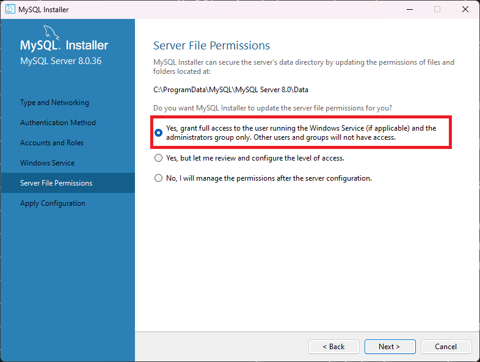
- Se recomienda seleccionar **"Yes, grant full access to the user running the Windows Service (if applicable) and the administrators group only."** Esto establecerá los permisos necesarios para que el servicio de MySQL y los administradores del sistema tengan acceso completo a la carpeta de datos, mientras que otros usuarios y grupos no tendrán acceso.

Al elegir esta opción, el instalador de MySQL ajustará automáticamente los permisos de seguridad de la carpeta de datos, ubicada en `C:\ProgramData\MySQL\MySQL Server 8.0\Data`, lo que simplifica el proceso de configuración y ayuda a asegurar que el servidor de bases de datos se ejecute sin problemas de permisos.

Una vez seleccionada la opción de permisos haga clic en **"Next"** para proceder con la aplicación de la configuración.

### 2.11. Aplicación de la Configuración del Servidor MySQL

En la pantalla "Apply Configuration":
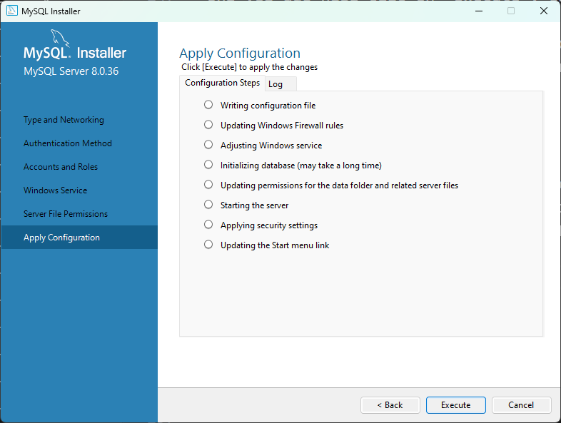

- Revise la lista de pasos de configuración que el instalador ejecutará. Estos incluyen:
   - **Writing configuration file**: El instalador creará un archivo de configuración con todas las opciones que has establecido.
   - **Updating Windows Firewall rules**: Se agregarán las reglas necesarias al firewall de Windows para permitir el tráfico al servidor MySQL.
   - **Adjusting Windows service**: El servicio de MySQL se registrará y configurará en Windows.
   - **Initializing database**: Se inicializará la base de datos del servidor MySQL, lo que puede tardar algún tiempo.
   - **Updating permissions for the data folder and related server files**: Los permisos del directorio de datos y los archivos relacionados con el servidor se ajustarán según lo seleccionado anteriormente.
   - **Starting the server**: El servicio MySQL se iniciará.
   - **Applying security settings**: Se aplicarán las configuraciones de seguridad seleccionadas, incluyendo el método de autenticación y las contraseñas de las cuentas.
   - **Updating the Start menu link**: Se actualizará el enlace del menú Inicio para MySQL.

Haga clic en **"Execute"** para comenzar a aplicar todas las configuraciones que ha seleccionado durante el proceso de instalación.

Una vez que haga clic en "Execute", el instalador comenzará a realizar las tareas listadas y mostrará el progreso en tiempo real. Es crucial no interrumpir este proceso para evitar cualquier problema de configuración.
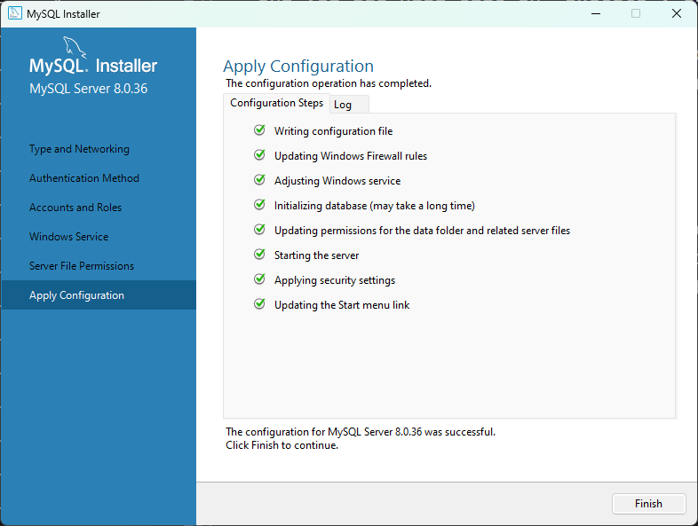

Una vez que todas las tareas se hayan completado con éxito, podrá hacer clic en **"finish"** para finalizar la instalación.

### 2.12. Confirmación de la Configuración del Producto

A continuación se mostrá un mensaje de confirmación indicando que la configuración del 'MySQL Server 8.0.36' ha finalizado correctamente. Para finalizar el proceso de instalación, haga clic en **"Next"**.
  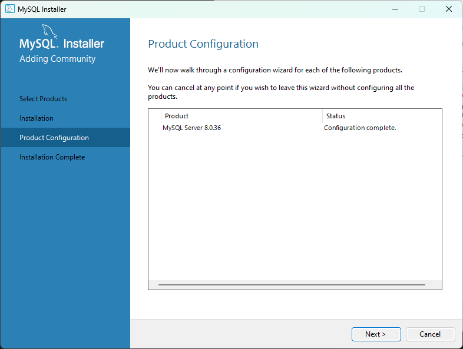

#### Instalación de MySQL Completada
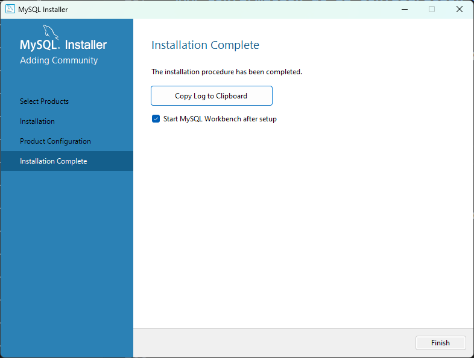

La instalación y configuración de su servidor MySQL ha finalizado con éxito.

- **Opción "Copy Log to Clipboard"**: Puede utilizar esta función si desea guardar un registro de la instalación. Es útil para revisar o diagnosticar la instalación si es necesario.

- **Opción "Start MySQL Workbench after setup"**: Esta casilla está marcada por defecto para abrir automáticamente MySQL Workbench después de la instalación. MySQL Workbench es una herramienta visual para diseñar, desarrollar y administrar bases de datos MySQL.

Una vez esté listo, haga clic en **"Finish"** para cerrar el instalador y, si está seleccionado, iniciar MySQL Workbench.

Posteriormente visualizará la pantalla de inicio de MySQL Workbench, que es la herramienta gráfica de usuario (GUI) oficial para la gestión de bases de datos MySQL. 

#### Página de Inicio de MySQL Workbench

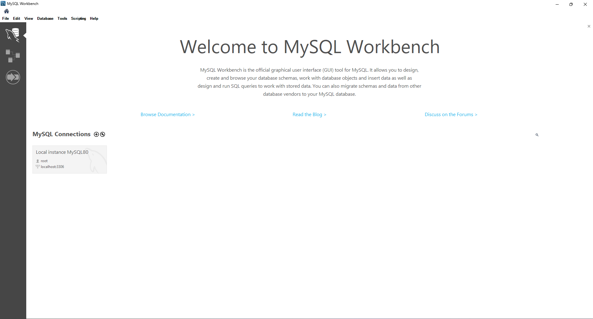

- **Conexiones MySQL**: Verá la conexión 'Local instance MySQL80' listada. Esta es la instancia local de MySQL Server que acaba de instalar y configurar. Puede hacer doble clic en esta conexión para iniciar la interfaz de administración de la base de datos.

- **Interfaz Principal**: A través de esta interfaz, podrá diseñar esquemas de bases de datos, administrar objetos de base de datos, introducir y manipular datos, y ejecutar consultas SQL.

- **Opciones Adicionales**: Los enlaces para 'Browse Documentation' (Navegar por la Documentación), 'Read the Blog' (Leer el Blog) y 'Discuss on the Forums' (Discutir en los Foros) están disponibles para recursos adicionales y soporte comunitario.

- **Barra de Herramientas Lateral**: A la izquierda, la barra de herramientas proporciona acceso rápido a funciones comunes como la creación de nuevas consultas, diseño de modelos de bases de datos, importación y exportación de datos, entre otras..

## 3. Requerimientos de Configuración de Hardware para MySQL 8.0

**CPU:**
- Recomendado: Procesador multi-core (por ejemplo, Intel Core i5 o superior, AMD Ryzen 5 o superior).
- Mínimo: Procesador de doble núcleo (por ejemplo, Intel Core i3, AMD Ryzen 3).

**Memoria RAM:**
- Recomendado: 8 GB o más.
- Mínimo: 4 GB.

**Almacenamiento:**
- Recomendado: Unidad de estado sólido (SSD) con al menos 20 GB de espacio libre para un mejor rendimiento.
- Mínimo: Disco duro con al menos 10 GB de espacio libre.

**Sistema Operativo:**
- Debe ser un sistema operativo compatible con MySQL 8.0, como Windows 10, Windows Server 2016/2019, o distribuciones recientes de Linux como Ubuntu 18.04 LTS o posterior.

**Red:**
- Conexión a internet para la descarga de software y actualizaciones (no requerido para la operación posterior de MySQL en entornos aislados).

**Otros:**
- Controlador de gráficos compatible para la ejecución de MySQL Workbench, si es necesario.
- Permisos adecuados para la instalación y configuración de servicios en el sistema operativo.

Es importante tener en cuenta que los requerimientos de hardware para MySQL pueden ajustarse sustancialmente en función de la carga de trabajo específica y complejidad de las bases de datos gestionadas, así como la cantidad de usuarios concurrentes. Para despliegues de producción o situaciones que demanden alto rendimiento, es aconsejable contemplar configuraciones de hardware más robustas y, si es necesario, hardware especializado. Para obtener información detallada sobre las recomendaciones específicas para diferentes escenarios de uso, es recomendable consultar la [documentación oficial de MySQL](https://dev.mysql.com/doc/refman/8.0/en/).

## Referencias

- MySQL. (n.d.). *MySQL 8.0 Reference Manual*. Recuperado de https://dev.mysql.com/doc/refman/8.0/en/

