# Tutorial de Implementación
### Gestor de Base de Datos MySQL Community Edition
#### Elaborado por Grupo 4 INF-272

## 1. Creación de una base de datos

### PRIMERA FORMA
### CREACIÓN DE LA BASE DE DATOS POR COMANDO
1. Una vez instalada la gestion de base de datos se visualizara en nuestra menú MySQL 8.0 Command Line Client. 


2.	Ya dentro de la MySQL,aparecerá la siguiente ventana de comando del gestor de base de datos, donde se deberá ingresar la misma contraseña que se agrego al momento de la instalación.

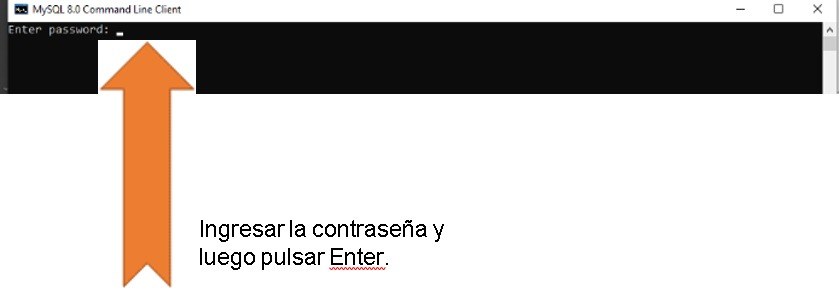

3.	 En esta parte se deberá agregar el nombre con el que quiere ser creada la base de datos.

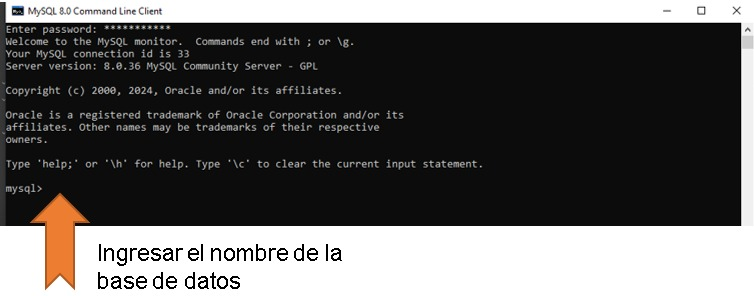

4.	Al ingresar el nombre de la base de dato debe ir por delante la siguiente sentencia `create database nombre_basedato;`

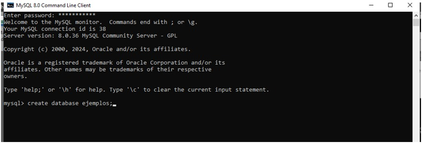


5.	Una vez creada la base de datos se vera en la en el gestor de base de datos Workbench.
Base de datos creada satisfactoriamente.

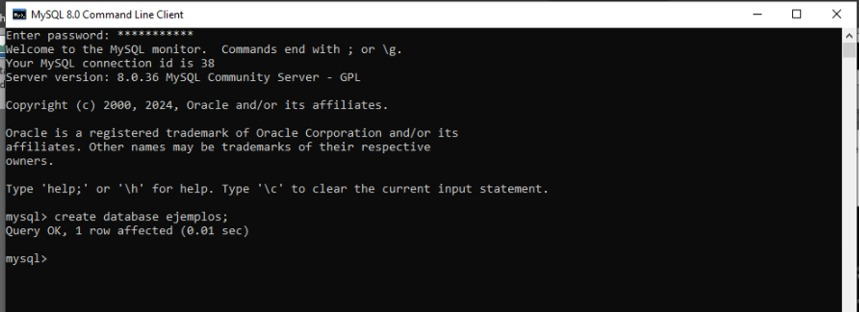


6.	Ingresamos a la gestor MySQL Workbench;ahora se debera ingresar a la conexión creada.

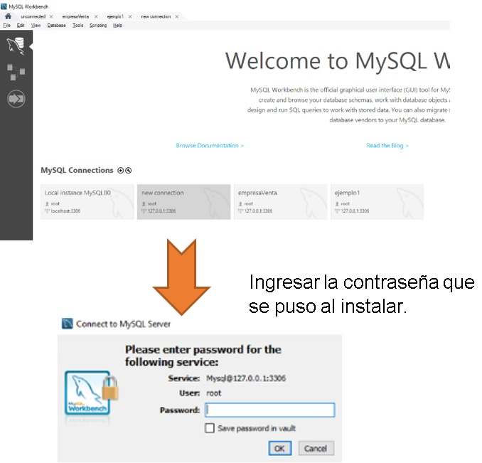


7. Prueba satisafactoria que la base de datos fue creada de manera optima.

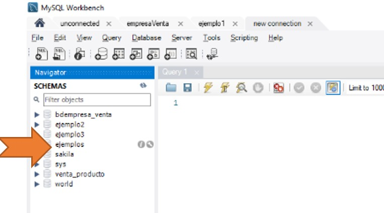


#### SEGUNDA FORMA
#### CREACION DE LA BASE DE DATOS POR COMANDO
1.	TENIENDO LA CONEXIONES REALIZAMOS CLIK EN EL ICONO +, PARA AGREGAR UNA BASE DE DATOS.

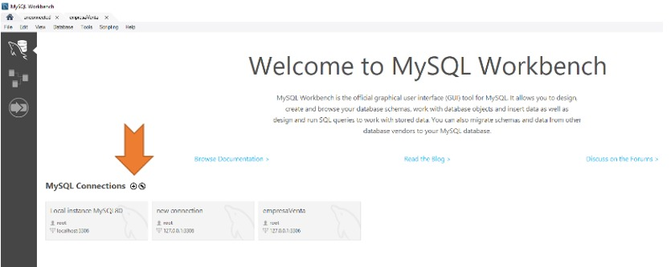


2.	EN LA SIGUIENTE PESTAÑA INGRESAREMOS EL NOMBRE. DE LA BASE DE DATOS 


3. INGRESAMOS LA MISMA CONTASEÑA DE INSTALACION, LA CONEXIÓN ESTARA LISTA

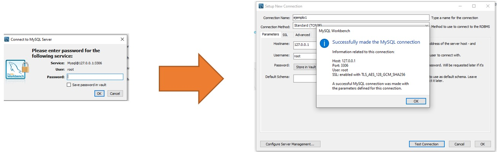


4.	Y nos llevara automáticamente a la verificación de que fue creada.

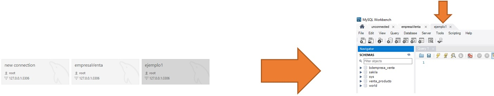


5.	Usando una pestaña query tambien podemos realizar la creacion de la base de datos con el parametro create database nombre_basededato; una vez  creada para ejecutar la sentencia pulsamos clic donde  indica la flecha.

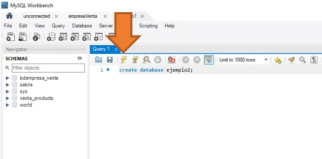


6.	Comprobamos que fue creada de manera sencilla.

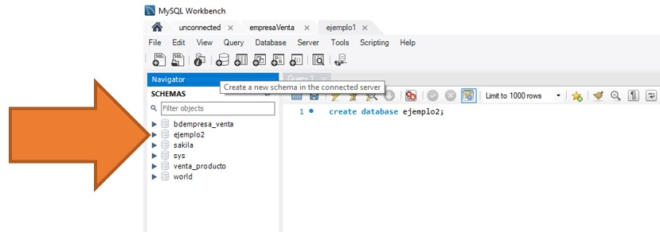


7.	La siguiente manera de crear es asiendo clic en donde indica la flecha.

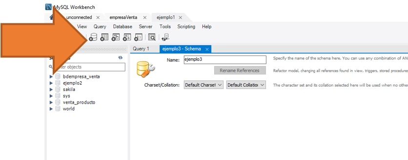


8.	Ingresamos el nombre, y buscamos la opción `utf8` para los caracteres y `utf8_general_ci `.

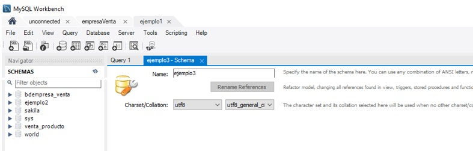


9.	Nos aparecerá la sentencia de la creación en sql, hacemos clic en `Apply` para aplicar la creacion.

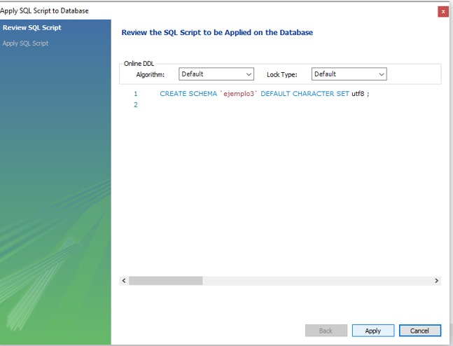


10. Y para concluir  hacemos clic en `finalizar`.

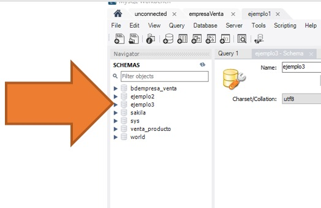


Importante. Es importante actualizar después de crear la base de datos para verificar de su creación.


## 2. Procedimientos Almacenados
### Sintaxis General - MySql
```sql
CREATE
    [DEFINER = user]
    PROCEDURE [IF NOT EXISTS] sp_name ([proc_parameter[,...]])
    [characteristic ...] routine_body

proc_parameter:
    [ IN | OUT | INOUT ] param_name type

characteristic: {
    COMMENT 'string'
  | LANGUAGE SQL  | [NOT] DETERMINISTIC
  | { CONTAINS SQL | NO SQL | READS SQL DATA | MODIFIES SQL DATA }
  | SQL SECURITY { DEFINER | INVOKER }
}
routine_body:
    SQL routine
```
**Sintaxis Especifica - MySql**
```sql
DELIMITER //

CREATE PROCEDURE nombre_procedimiento (
    parametro1 tipo,
    parametro2 tipo,
    ...
)
[CARACTERÍSTICAS]
BEGIN
    Cuerpo del procedimiento (sentencias SQL)
END //

DELIMITER ;
```
**Ejecución** 
```sql
CALL nombre_procedimiento(parametro1, parametro2, ...);
```
Si el procedimiento tiene parámetros de salida, podemos utilizar variables de usuario para capturar los resultados, así:
```sql
CALL mi_procedimiento(parametro_entrada, @resultado_salida);
SELECT @resultado_salida;
```
Donde `@resultado_salida` es una variable de usuario que almacenará el valor devuelto por el procedimiento.

### CREACIÓN DE PROCEDIMIENTOS EN MYSQL
**Paso 1:** Abrimos MySQL Workbench y nos conectamos a nuestro servidor MySQL.

 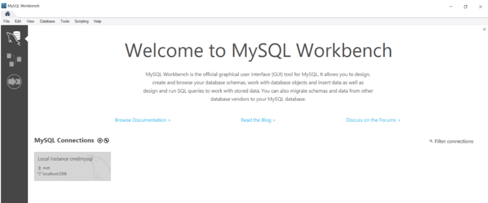

**Paso 2:** Hacemos doble clic en la base de datos que deseamos usar y se pondrá en negrilla.

 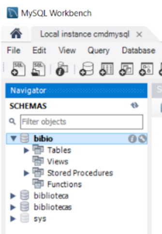


**Paso 3:** Nos vamos al esquema de la base de datos donde deseamos crear el procedimiento almacenado. También puedes seleccionar el logo izquierdo superior, desplegará un ventana para ingresar código.

 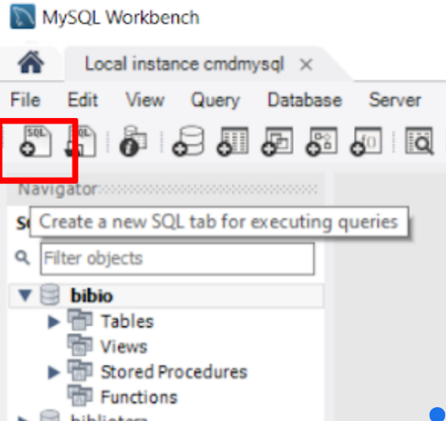
 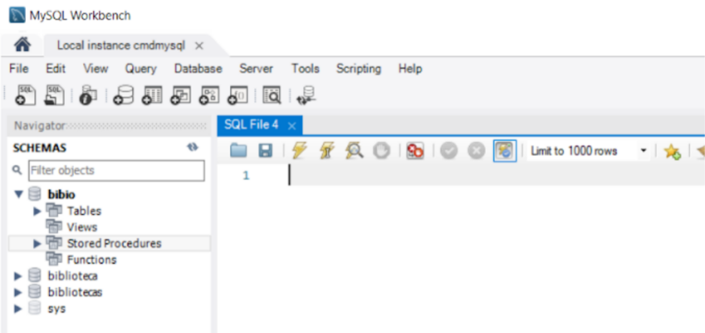


**Paso 4:** Hacemos clic con el botón derecho del ratón en la carpeta " Stored Procedures" (o "Procedimientos Almacenados" en español) bajo el esquema seleccionado y selecciona `Create Stored Procedure...` 

 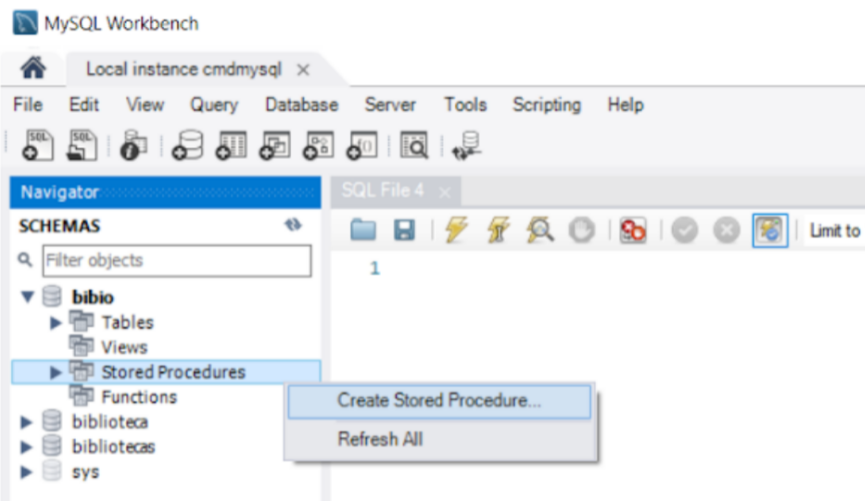


**Paso 5:** Se abrirá una ventana de edición SQL. En esta ventana, podemos escribir el código para el procedimiento almacenado. Esto incluirá la definición del procedimiento, los parámetros de entrada y salida (si los hay), y el cuerpo del procedimiento con las instrucciones SQL que deseas ejecutar.
**La instrucción para el procedimiento será el siguiente:** Crear un procedimiento que devuelva el nombre del libro y la editorial en la cual haya sido editada por id de documento (xiddoc).
 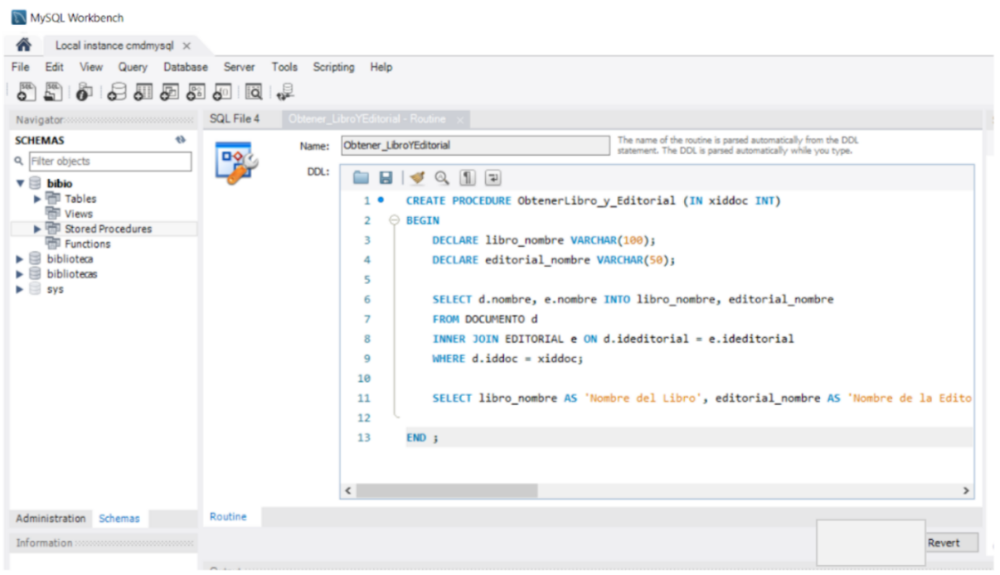


**Paso 6:** Una vez que hayas terminado de escribir el código del procedimiento, haz clic en el botón`Apply` (o "Aplicar" en español) en la parte inferior de la ventana de edición SQL.
**Paso 7:** Se te pedirá que confirmes la creación del procedimiento. Haz clic en `Apply` (o "Aplicar" en español) nuevamente para confirmar.

 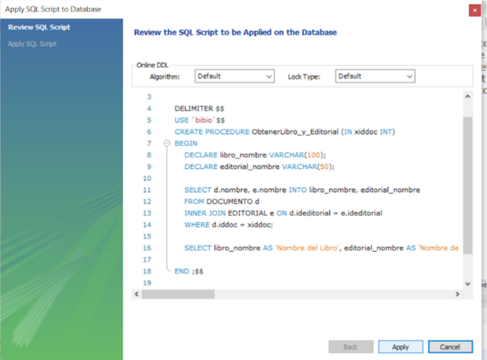


**Paso 8:** Si todo está bien, verás un mensaje indicando que la operación fue exitosa. Haz clic en "Finish" (o "Finalizar" en español) para cerrar la ventana.

 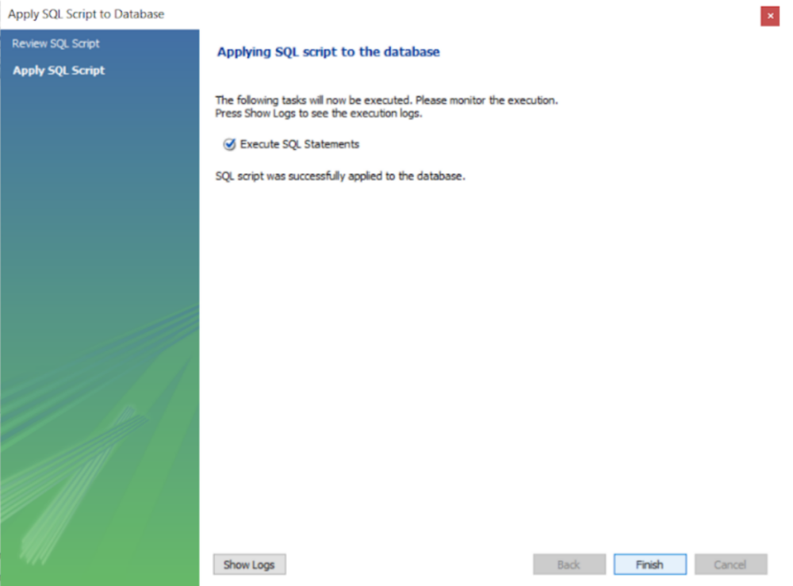


**Paso 9:** Ejecutamos el procedimiento `ObtenerLibro_y_Editorial(1)` 

 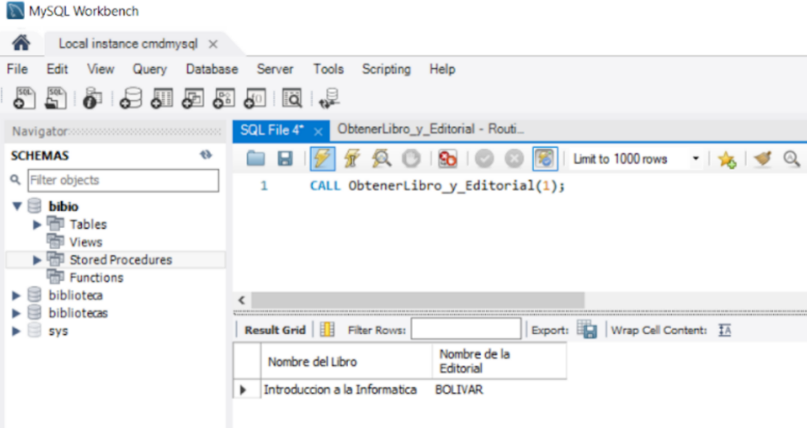


Finalmente se muestra el nombre del libro y la editorial en la cual ha sido editada del id 1.

## 3. Funciones Almacenadas
La sintaxis básica para crear una función en MySQL es la siguiente:

```sql
DELIMITER $$

CREATE FUNCTION NombreDeLaFuncion (parametro1 tipo, parametro2 tipo, ...)
RETURNS tipo
BEGIN
    -- Variable declarations
    DECLARE var1 tipo;
    DECLARE var2 tipo;
    -- ...

    -- Procesamiento

    -- Código que calcula algo

    -- Finalmente retornamos el resultado
    RETURN (expresión);
END$$

DELIMITER ;
```
En MySQL Workbench, puedes gestionar y crear funciones directamente a través de la interfaz gráfica siguiendo estos pasos para acceder al editor de funciones y escribir o modificar tus funciones SQL:

**Paso 1**: Conectar a la Base de Datos
Primero, asegúrate de estar conectado a la base de datos correcta. Al abrir MySQL Workbench, verás la pantalla de inicio donde puedes seleccionar una conexión existente o crear una nueva.

 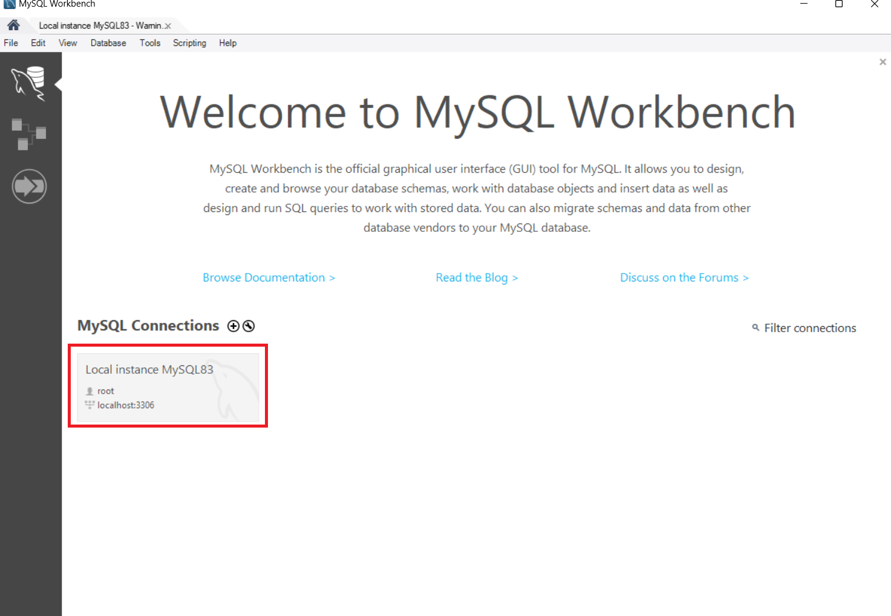
**Paso 2**: Navegar a través del Schema
Una vez conectado, en la barra lateral izquierda verás el `Navigator`, donde puedes expandir el esquema de la base de datos en la que deseas trabajar. Haz clic en el nombre de tu base de datos para ver las diferentes categorías de objetos de la base de datos como tablas, vistas, procedimientos almacenados, y funciones.
 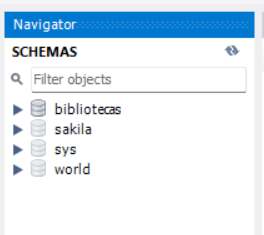


**Paso 3:** Acceder a las Funciones
Después de expandir el esquema, busca la carpeta llamada `Functions`.
Si haces clic en esta carpeta, se listarán todas las funciones existentes en la base de datos en el panel central.
 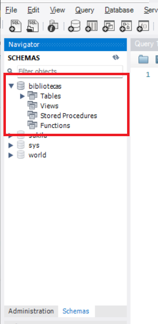
 
**Paso 4:** Crear o Modificar Funciones
Para crear una nueva función:
Haz clic derecho en la carpeta `Functions` y selecciona `Create Function...`.
 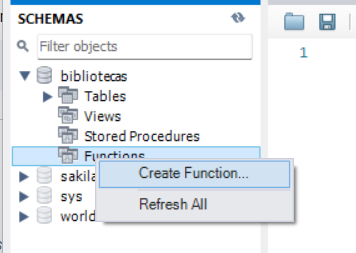

Esto abrirá un nuevo editor de funciones en la parte central de Workbench.
Puedes escribir tu código SQL para la función en este editor.
Una vez que hayas escrito el código de la función, puedes aplicar los cambios haciendo clic en el ícono de `Apply` (un check verde) en la barra de herramientas del editor.
Para modificar una función existente:
Haz doble clic en la función que deseas modificar desde la lista en el panel central o haz clic derecho y selecciona `Alter Function`.
Esto abrirá el editor con el código existente de la función.
Realiza los cambios necesarios en el código.
Aplica los cambios con el ícono de `Apply`.
 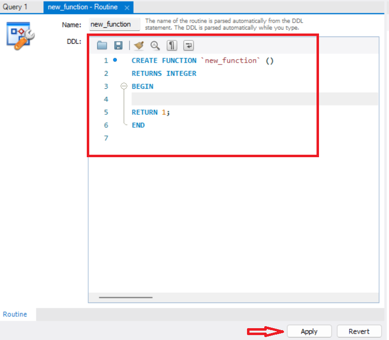
**Paso 5:** Guardar y Verificar
Después de hacer clic en `Apply`, MySQL Workbench mostrará un diálogo con el SQL que se ejecutará. Revisa este SQL y confirma haciendo clic en `Apply` en este diálogo para ejecutar el SQL en tu base de datos.
 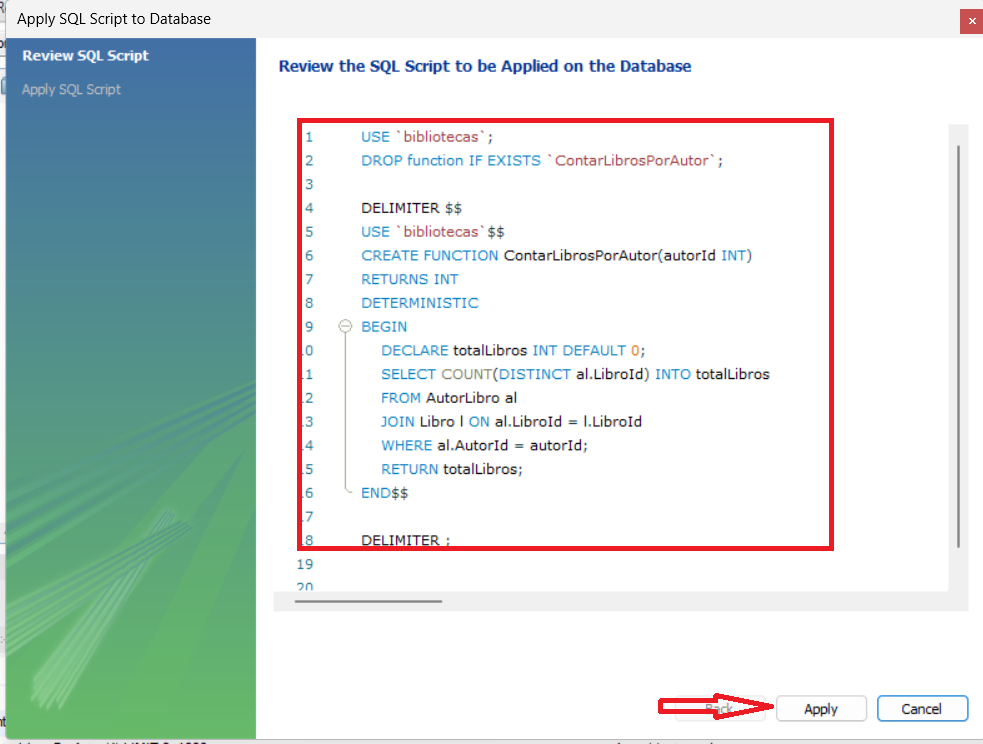

**Nota:** la función agregada despliega los libros escritos por el autor con AutorId X.
para llamar la funcion realizamos el comando select
 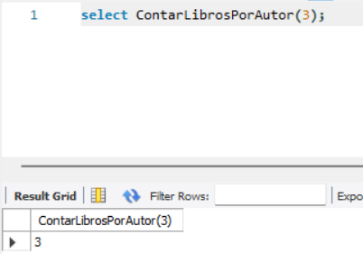
### Consejos Adicionales
**Revisa los errores:** Siempre verifica si hay errores en la salida cuando aplicas cambios. MySQL Workbench mostrará errores si el SQL tiene problemas.
**Usa el Snippet:** MySQL Workbench tiene `snippets` que puedes usar como plantillas para operaciones comunes, incluyendo la creación de funciones.
**Documenta tu Función:** Considera agregar comentarios a tu función para explicar lo que hace, especialmente si es compleja o si será usada por otros.
## 4. Cursores
En MySQL a diferencia de Oracle para poder manipular cursores es necesario crear un procedimiento, el cual será llamado más adelante para ejecutar dicho cursor, a continuación mostramos la estructura ideal para cursores explícitos, posteriormente mostraremos un ejemplo en Workbench.

### Estructura de Cursores Explícitos 
 **EJEMPLO DE CURSORES EXPLÍCITOS: CODIGO COMPLETO**
 

El cursor que hemos creado es un cursor explícito que recorre los registros de la tabla Usuario y, para cada usuario, calcula el total de préstamos asociados a ese usuario en la tabla Prestamo.

**EXPLICACIÓN DETALLADA DEL EJERCICIO:**

**PASO 1:** Usamos el delimitador La instrucción DELIMITER se utiliza para cambiar el delimitador de comandos en MySQL. Por defecto, el delimitador es ;, lo que significa que cada comando SQL termina con un punto y coma (;). Sin embargo, cuando creamos procedimientos almacenados, funciones, desencadenadores u otros bloques de código que contienen múltiples declaraciones SQL, necesitamos cambiar el delimitador para que MySQL pueda distinguir entre el final del procedimiento almacenado y el final de las instrucciones SQL individuales dentro de él. Posteriormente definiremos el procedimiento con el nombre CalcularTotalPrestamosPorUsuario
 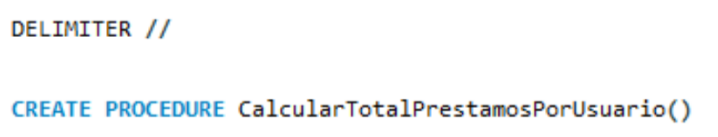
**PASO 2:** Declaramos las variables, la variable done1 es un indicador el cual nos ayuda a poder controlar si tenemos datos en el cursor si el valor es true entonces significa que ya no tenemos mas datos en el cursor.
 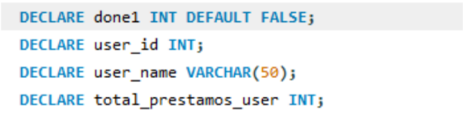
**PASO 3:** Declaramos el cursor para recorrer los usuarios
 
**PASO 4:**  El manejador de resultados no encontrados Continue Handler lo que hace es verificar si ya no existe mas registros si ya no existe entonces cambiamos el valor de done1 a True para poder salir ya de el bucle del cursor.
 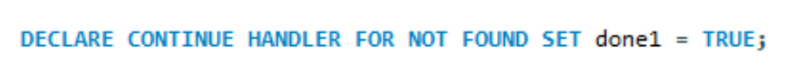

**PASO 5:** Abrimos el cursor

 

**PASO 6:** Recorremos todos los usuarios devueltos por el cursor
 

 **PASO 7:** Obtenemos el id del usuario y su nombre, luego  en el if verificamos si done1 es True si es true significa que ya no hay mas registros por lo cual usamos leave user loop para terminar el loop en el caso de que ya no haya más registros.

  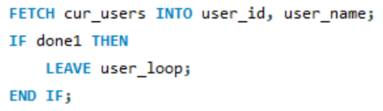

**PASO 8:** Inicializamos el total de préstamos en 0
 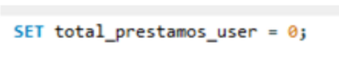

**PASO 9:** Consultamos para obtener el total de préstamos del usuario actual e imprimimos el resultado.
 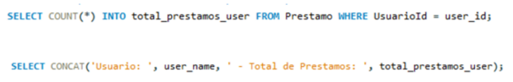

 **PASO 10:** Terminamos el loop, cerramos el cursor y terminamos el Procedimiento y restablecemos el delimitador a su valor predeterminado
 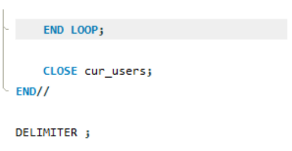

 **PASO 11:** ejecutamos el procedimiento con el siguiente comando
  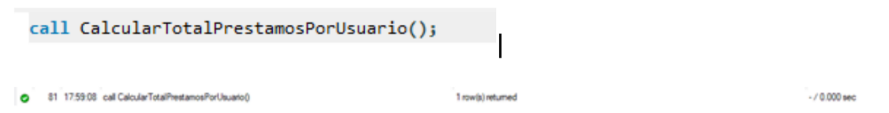

### Salida en Mysql Workbench
 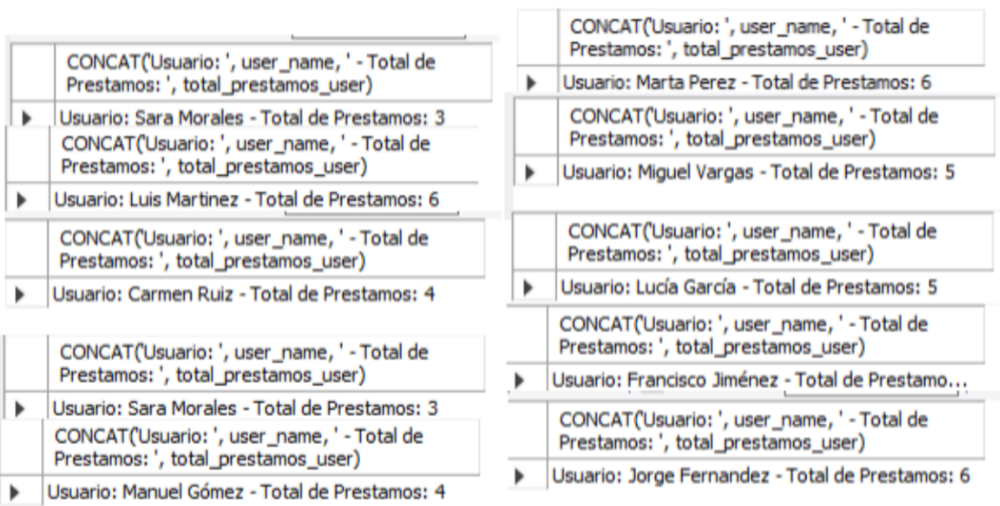

## 5. Triggers

## Manual de Creación de Triggers en MySQL con MySQL Workbench

#### 1. Introducción a los Triggers

##### 1.1 Definición de Trigger
Un *trigger* es un procedimiento almacenado en una base de datos que se ejecuta automáticamente cuando ocurren eventos específicos en una tabla o una vista. Los eventos que pueden iniciar un *trigger* incluyen `INSERT`, `UPDATE`, o `DELETE`.

##### 1.2 Propósito y Utilidad de los Triggers
Los *triggers* son esenciales para:
- **Automatizar procesos** relacionados con la integridad y el mantenimiento de los datos.
- **Validar modificaciones** en la base de datos para garantizar la coherencia de los datos.
- **Auditar cambios** en las tablas mediante el registro de actividades.

#### 2. Sintaxis y Componentes de un Trigger

##### 2.1 Sintaxis General
La sintaxis básica para crear un *trigger* en MySQL es la siguiente:

```sql
CREATE TRIGGER [IF NOT EXISTS] nombre_del_trigger
  tiempo_del_trigger evento_del_trigger
  ON nombre_tabla FOR EACH ROW
  [orden_del_trigger]
  cuerpo_del_trigger;
```

##### 2.2 Descripción de Componentes
- **`IF NOT EXISTS`**: Opción para prevenir errores de duplicación al crear un *trigger* que ya existe.
- **`nombre_del_trigger`**: Identificador único dentro de la base de datos para el *trigger*.
- **`tiempo_del_trigger`**: Indica si el *trigger* actúa `BEFORE` (antes) o `AFTER` (después) del evento.
- **`evento_del_trigger`**: Define el evento que activará el *trigger* (`INSERT`, `UPDATE`, `DELETE`).
- **`nombre_tabla`**: La tabla sobre la que el *trigger* tiene efecto.
- **`FOR EACH ROW`**: Especifica que el *trigger* se ejecutará para cada fila afectada por el evento.
- **`orden_del_trigger`**: Especifica el orden de ejecución en relación con otros *triggers* (`FOLLOWS` o `PRECEDES` otro *trigger*).
- **`cuerpo_del_trigger`**: Contiene las declaraciones SQL que se ejecutarán cuando se active el *trigger*.

#### 3. Implementación Práctica de un Trigger en la Base de Datos "Sakila"

##### 3.1 Preparación de la Base de Datos
Asegúrese de que la tabla sobre la que se creará el *trigger* tiene las columnas necesarias. Por ejemplo, para un *trigger* que contabilice los alquileres, la tabla `film` debe tener una columna `rental_count`.

```sql
USE sakila;

ALTER TABLE film
ADD COLUMN rental_count INT DEFAULT 0 NOT NULL;
```

##### 3.2 Creación del Trigger
Ejemplo de *trigger* para incrementar un contador cada vez que se registra un nuevo alquiler:

```sql
DELIMITER $$

CREATE TRIGGER increment_rental_count
AFTER INSERT ON rental
FOR EACH ROW
BEGIN
    UPDATE film
    SET rental_count = rental_count + 1
    WHERE film_id = (SELECT film_id FROM inventory WHERE inventory_id = NEW.inventory_id);
END$$

DELIMITER ;
```

##### 3.3 Validación y Pruebas
Después de implementar el *trigger*, es fundamental probar su funcionamiento:

```sql
INSERT INTO rental (rental_date, inventory_id, customer_id, staff_id)
VALUES (NOW(), 1, 1, 1);

SELECT film_id, rental_count FROM film WHERE film_id = 
    (SELECT film_id FROM inventory WHERE inventory_id = 1);
```

#### 4. Gestión de Triggers

##### 4.1 Modificación de Triggers
Para modificar un *trigger*, primero debe ser eliminado y luego redefinido con las nuevas especificaciones.

##### 4.2 Eliminación de Triggers
Para eliminar un *trigger* cuando ya no es necesario o para reemplazarlo:

```sql
DROP TRIGGER IF EXISTS schema_name.nombre_del_trigger;
```


 